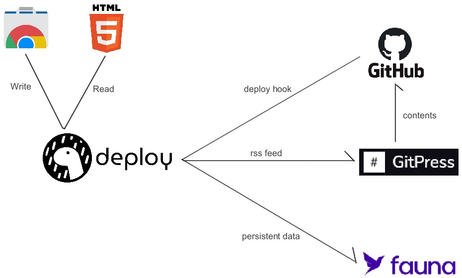
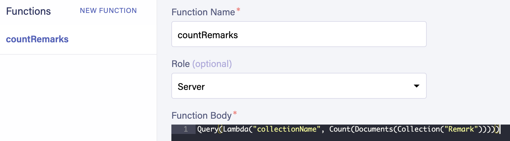

# GitPress

Fork me to start using [GitPress](https://gitpress.io)

Posts are placed in `/source` folder, so fill the directory with `/source`

## Architecture


## Setup

### On Fauna

Dashboard > GraphQL > Upload [schema.gql](./schema.gql)

Then set `countRemarks` function as follows:



### Install Deno and deployctl

```bash
$ curl -fsSL https://deno.land/x/install/install.sh | sh
$ deno install --allow-read --allow-write --allow-env --allow-net --allow-run --no-check -f https://deno.land/x/deploy/deployctl.ts
```

## Deploy

```
$ FAUNA_SECRET=<secret> deployctl run --watch --libs=ns,fetchevent ./server.ts
```

if fail it, add `--no-check` option.

## Local Develepment

### VSCode

Set your secret key using a `.faunarc` file for a project.\
https://github.com/fauna/vscode#1-set-your-secret-key

## Step by step

References

- [Deno deploy tutorial-faunadb](https://deno.com/deploy/docs/tutorial-faunadb)
